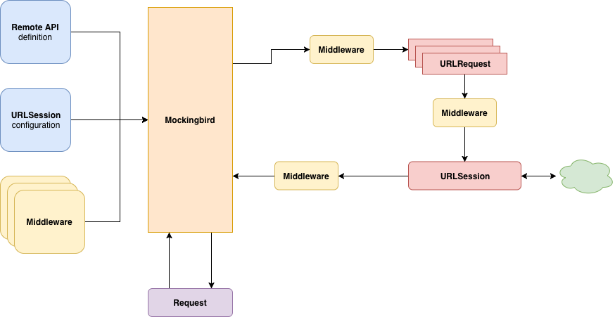

[](https://circleci.com/gh/jandro-es/Mockingbird/tree/master)
[](https://codecov.io/gh/jandro-es/Mockingbird)  [](https://github.com/jandro-es/Mockingbird/blob/master/LICENSE)  [](https://github.com/apple/swift-package-manager)    

# Mockingbird

**Mockingbird** is a **N**etwork **A**bstraction **L**ayer *(NAL)* written in swift leveraging the power and versatility of *Foundation's* **URLSession**. It's compatible with **iOS** version *9* or greater and **macOS** version *10.12* or greater.

It draws inspiration from [Moya](https://github.com/Moya/Moya) and [Alamofire](https://github.com/Alamofire/Alamofire) with a focus in easier integration and unit testing of the network layer.

## Table of contents
- [Mockingbird](#mockingbird)
  - [Table of contents](#table-of-contents)
  - [Installation](#installation)
    - [Cocoapods](#cocoapods)
    - [Swift Package Manager](#swift-package-manager)
  - [Architecture](#architecture)
  - [Using Mockingbird](#using-mockingbird)
  - [Logging](#logging)
  - [Middleware](#middleware)
  - [Comming soon](#comming-soon)
  - [Reporting bugs or requesting features](#reporting-bugs-or-requesting-features)
  - [Contributing](#contributing)
  - [License](#license)

## Installation

At the moment only **Cocoapods** and **Swift Package Manager SPM** are supported, with support for *Carthage* comming soon.
**Swift 4.x** and **Xcode 10.x** are required to build it.

### Cocoapods

To install `Mockingird` using **Cocoapods** just add it to your project's `Podfile`:

```bash
 pod 'Mockingbird-Swift'
```

and if you want to use the **RxSwift** extensions add them:

```bash
pod 'Mockingbird-Swift/RxSwift'
```

To use the library in your application please import the Swift module as follows:

```swift
import Mockingbird_Swift
```

### Swift Package Manager

Just add `Mockingbird` as a dependency in your `Package.swift` file:

```swift
dependencies: [
    .package(url: "https://github.com/jandro-es/Mockingbird", .upToNextMajor(from: "1.0.0"))
]
```

## Architecture

**Mockingbird** simplifies the creation of a network layer in your application. You can define your entire layer in a declarative way by implementing the `RemoteServiceType` protocol in your different types. Generating a simple map of your network endpoints. Mockingbird uses `URLSession` as it's undelying network system, exposing it's configuration, allowing you to customise it, among many other customisations, as needed.
A simplified architecture diagram:



## Using Mockingbird

## Logging

## Middleware

## Comming soon

## Reporting bugs or requesting features

## Contributing

## License
